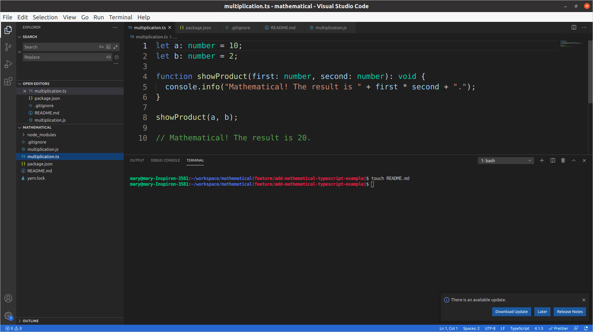

### mathematical
A Typescript example - coded for learning purposes.

## Built With

- TypeScript

## Description

A TypeScript example - coded for learning purposes by following this [tutorial](https://www.freecodecamp.org/news/what-is-typescript/).

## Compiling a *.js file to a *.ts file
 - Run
  `yarn tsc multiplication.ts`

## Authors

👤 **Marylene Sawyer**
- Github: [@Bluette1](https://github.com/Bluette1)
- Twitter: [@MaryleneSawyer](https://twitter.com/MaryleneSawyer)
- Linkedin: [Marylene Sawyer](https://www.linkedin.com/in/marylene-sawyer-b4ba1295/)

# Acknowledgements

- The content in this repository was retrieved from or inspired by the following sites
  - [What is TypeScript](https://www.freecodecamp.org/news/what-is-typescript/)

## 🤝 Contributing

Contributions, issues and feature requests are welcome!